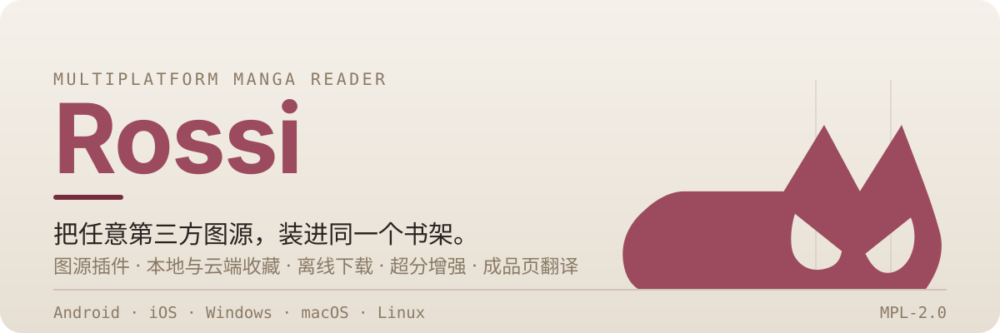
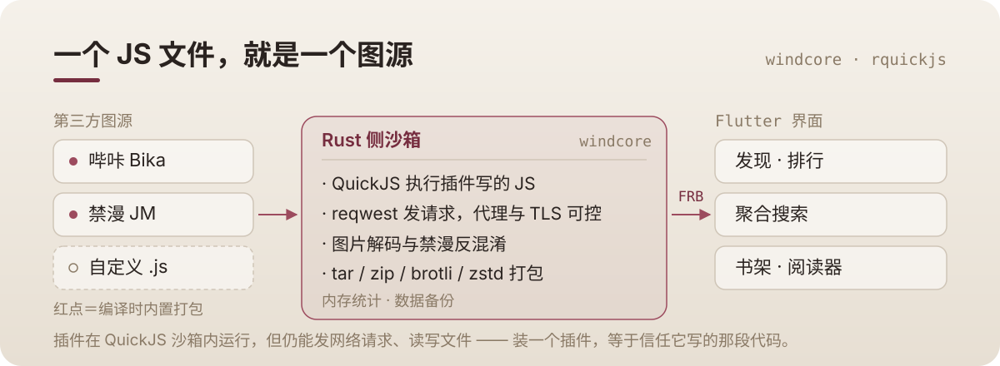
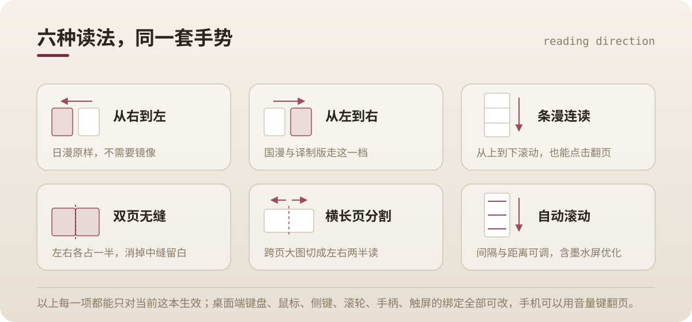
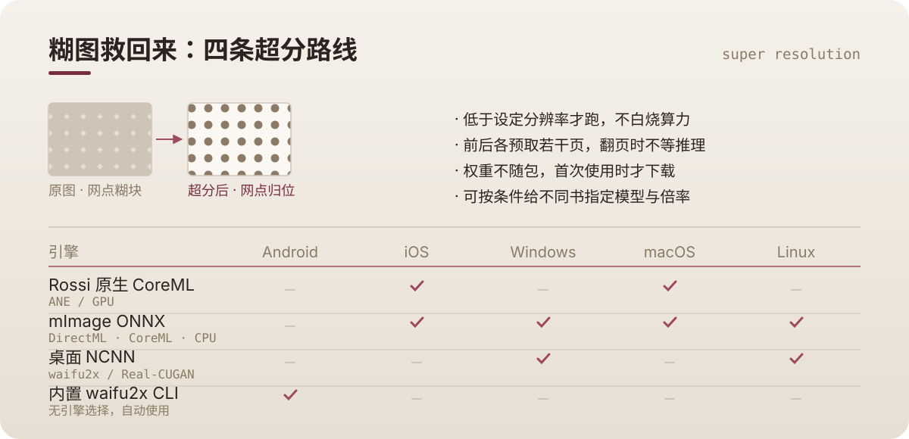
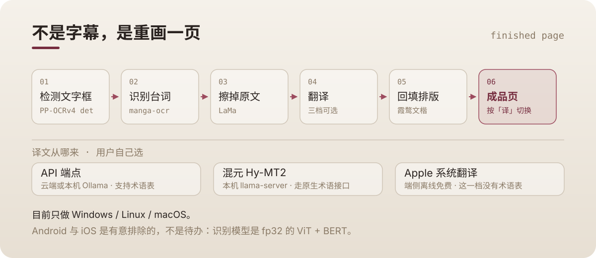

<p align="center">
  
</p>

## Rossi 是什么

一个用 **Flutter + Rust** 写的跨平台漫画阅读器。

它自己**不带任何漫画内容**。书从哪来，全靠**插件**：一个 JS 文件描述清楚「列表怎么取、搜索怎么发、图片怎么还原」，Rust 侧的 QuickJS 沙箱负责把它跑起来。装什么插件，就读什么源；不装，它就是个读本地 CBZ 的干净书架。

内置哔咔与禁漫两个插件，编译时打包进二进制，开箱即用。

---

## 能力一览

### 图源与搜索

- 内置哔咔、禁漫；也可自行安装 `.js` / `.cjs` / `.br` 插件，或从[插件列表](https://github.com/deretame/Breeze-plugin-list)一键下载、手动更新、拖拽排序。
- **聚合搜索**：一次向多个源发问。搜索支持标签语法与排除词，并带搜索历史。
- EHentai 标签词典随包，中英对照，不用自己猜标签。
- 本地 CBZ / ZIP 与压缩包直接读，不需要先解压。

### 阅读

- 六种读法：从右到左（日漫原样）、从左到右、条漫纵向、双页并排（可无缝拼接、可首页错版）、横长页自动分割、自动滚动。
- **每一本都能单独覆盖设置**，不动全局那一份。
- 墨水屏优化、音量键翻页、左右手模式、环境色背景、缩略图快速跳转、操作栏常驻。
- 桌面端键位全可自定义：键盘、鼠标、鼠标侧键、滚轮、手柄、触屏、区域手势，分「全局」与「阅读器」两套上下文。

### 书架与下载

- 收藏分**本地**与**云端**两种，收藏夹可分组。
- 追更页专门列出「更新了但还没看」的。
- 自研下载队列：任务管理器、失败增量重试、边下边读，可导出 ZIP / 相册 / 文件夹，也能重新导入。
- **WebDAV 与 S3 同步**（含 path-style 开关），支持手动触发上传下载。

### 画面增强

- 四条超分路线，按平台自动挑可用的一档：Rossi 原生 CoreML（ANE / GPU）、mImage ONNX（DirectML / CoreML EP / CPU）、桌面 NCNN（waifu2x、Real-CUGAN）、Android 内置 waifu2x CLI。
- 只在低于设定分辨率时才跑，前后各预取若干页，换模型或换倍率会重算缓存而不是继续显示旧的。
- 超分权重不随包，首次使用时下载。

### 漫画翻译（成品页）

- 检测 → 识别 → 擦字 → 翻译 → 回填，产出一页**重排过的**图，而不是在原文上叠字幕。
- 译文引擎三档自选：API 端点（云端，或本机 Ollama / Foundry Local）、本机混元 Hy-MT2、Apple 系统翻译（端侧离线免费）。
- 术语表每行一条「原文=译文」，专名可以自己钉。
- 目前只做 Windows / Linux / macOS，详见[这一节](#漫画翻译成品页)。

### 其他

- 应用内检查更新与更新日志；20 档预设主题色（默认那档就是图标上的「面具红」）+ 跟随系统深浅色 + 动态取色。
- 自定义阅读字体；数据备份导入导出；缓存管理；GitHub / jsdelivr 加速代理；手势与 PIN 应用锁。
- macOS / Linux 系统托盘。

---

## 它是怎么跑起来的

<p align="center">
  
</p>

链路是 `Dart → Flutter Rust Bridge → Rust → QuickJS`。插件代码不在 Dart 里跑，也不碰平台 API：它只能描述「发什么请求、怎么解析、图片怎么还原」，网络和文件能力由宿主按 feature 授予。

> ⚠️ **插件仍是 beta 阶段**，API 可能有较大改动，目前更适合学习而非正式开发。
> 但请记住：插件在沙箱内依然能发网络请求、读写文件——**装一个插件，等于信任它写的那段代码。**

- 插件开发文档：<https://deretame.github.io/plugin-dev-docs/>
- 插件列表：<https://github.com/deretame/Breeze-plugin-list>

---

## 六种读法

<p align="center">
  
</p>

方向、翻页、双页配对、自动滚动间隔这些都不止一个开关，所以做成了「全局一份 + 每本单独覆盖一份」。桌面端还有一套完整的按键绑定编辑器，键盘、鼠标、侧键、滚轮、手柄、触屏、区域手势都能重映射。

---

## 四条超分路线

<p align="center">
  
</p>

矩阵里打勾的是**这条路线在这个平台上真的能跑**。选引擎时不用记这张表——默认值就是本平台可用档里的推荐项，但如果你从别的平台同步过来一个本平台跑不了的设置，它会落回默认而不是报错。

---

## 漫画翻译（成品页）

<p align="center">
  
</p>

和「叠加一层翻译」的区别在于：这条路会**把原文从图上擦掉**，再按气泡形状把译文排回去，产出的是一张可以直接看的图。在阅读器工具条上按「译」，只切换当前这一页。

需要知道的限制：

- **只有 Windows / Linux / macOS 有。** Android 与 iOS 是有意排除的，不是待办——本仓的 ONNX Runtime 在 linux/android 两段没注册任何加速器 EP，而识别模型是 fp32 的 ViT + BERT，移动端要可用得先做 int8 重导出。所以入口在移动端整条不画，而不是点了报错。
- 权重不随包，约 **660 MB**，首次使用时在设置页下载（PP-OCRv4 检测 + manga-ocr 识别 + LaMa 擦字）。
- 三档译文引擎各有取舍：API 端点要网络或本机服务、支持术语表；混元 Hy-MT2 要自己起 `llama-server`；Apple 系统翻译端侧离线免费，但**没有术语表接口**，这一档下专名会按通用译法翻。
- 端点当时不可用会**降级**：那一页只做擦字与原文回填，不会卡住整本。
- 成品页有缓存，换模型或换字体后可以一键清空（不会动原图）。
- 每一页的六道关都记一行日志，出问题在设置页里能直接看到是哪一步。

---

## 下载与安装

前往 [Releases 页面](https://github.com/deretame/Breeze/releases) 选择对应平台的文件：

| 平台 | 文件 | 安装方式 |
| :--- | :--- | :--- |
| Android / 鸿蒙 | `app-arm64-v8a-release.apk` | 直接安装 |
| Windows | `windows-installer.exe` | 双击运行 |
| macOS | `Breeze-macOS.dmg` 或 Homebrew | `brew install --cask breeze` |
| Linux | `breeze.flatpak` 或 `breeze_*.deb` | Flatpak / apt |
| iOS / iPadOS | `Breeze-iOS.ipa` | 侧载并自行签名 |

<details>
<summary><b>Android / 鸿蒙</b></summary>

下载 `app-arm64-v8a-release.apk` 直接安装。

> **注意**：中国大陆内因未经审核应用可能无法安装，可以使用 [GBox](https://gboxlab.com/i18n/zh-Hant/)、[出境易](https://www.chujingapp.com/) 或 [GSpace](https://gspaceteam.com/)（鸿蒙系统可通过应用商店下载）的方式绕过系统安装器，以安装应用。

</details>

<details>
<summary><b>Windows</b></summary>

下载 `windows-installer.exe` 后直接运行即可完成安装。

需要 Visual Studio (C++) 或相应的 GCC 工具链支持 Rust 的本地编译产物运行。

</details>

<details>
<summary><b>macOS</b></summary>

**方法 1：Homebrew（推荐）**

```bash
brew tap deretame/breeze
brew install --cask breeze

# 升级
brew upgrade breeze

# 彻底卸载，连同数据库、缓存和配置一起清理
# 注意：不会删除你手动导出的文件，但会清空 App 内部数据
brew uninstall --zap breeze
```

**方法 2：手动安装 DMG**

1. 下载最新的 `Breeze-macOS.dmg`。
2. 双击打开，把 `Breeze.app` 拖入 `Applications`（应用程序）文件夹。

> ⚠️ **首次启动（Gatekeeper）**
> 本项目是开源免费软件，未进行 Apple 开发者签名。首次打开若提示**「应用已损坏」**或**「无法验证开发者」**，在终端执行放行命令后即可正常使用：
>
> ```bash
> xattr -cr /Applications/Breeze.app
> ```
>
> 备选：在「应用程序」文件夹中找到 Breeze，按住 `Control` 键点击应用图标，在弹出菜单中选择「打开」。

</details>

<details>
<summary><b>Linux</b></summary>

同时提供 Flatpak 和 DEB 两种包。

**方式 1：DEB**（Debian/Ubuntu 及衍生版）

当前 Release 只提供 `amd64` 架构的 DEB 包。

```shell
# 当前目录只有刚下载的 DEB 包时可以直接用通配符
sudo apt install ./breeze_*.deb

breeze                    # 启动
sudo apt remove breeze    # 卸载
```

`apt` 会自动处理所需的系统依赖。安装完成后可以从应用菜单启动 **Breeze**，也可以在终端直接运行 `breeze`。

> **注意**：DEB 包不保证在所有 Debian/Ubuntu 衍生发行版上的兼容性和可用性。如果安装或运行异常，请改用 Flatpak 版本。

**方式 2：Flatpak**

1. 未配置 Flatpak 的先参考 [Flatpak 快速设置指南](https://flathub.org/zh-Hans/setup)。
   中国大陆用户建议配置 [CERNET 镜像源](https://help.mirrors.cernet.edu.cn/flathub/) 提速。
2. 本项目基于 GNOME 50 Runtime 构建，先装运行时：

   ```shell
   flatpak install flathub org.gnome.Platform//50
   ```

3. 下载 Release 里的 `breeze.flatpak` 并安装：

   ```shell
   flatpak install --user breeze.flatpak
   ```

4. 运行：

   ```shell
   flatpak run io.github.windy.breeze
   ```

</details>

<details>
<summary><b>iOS / iPadOS</b></summary>

iOS 系统封闭，未上架 App Store 的应用需要**侧载 (Sideloading) 并自行签名**。下载无签名的 `Breeze-iOS.ipa`，再用下列工具之一安装。

**推荐：AltStore** —— 目前最稳定且对新手友好，支持通过同一局域网下的电脑自动续签。

- 官网：<https://altstore.io/>
- [AltStore 官方图文指南（英文）](https://faq.altstore.io/)
- [知乎：基于 AltStore 的越狱工具自签教程](https://zhuanlan.zhihu.com/p/143936759)
- [哔哩哔哩：iOS 无限自签 IPA 玩法](https://b23.tv/UbuuJTZ)

**其他自签 / 免签方案**

- **Sideloadly**：免越狱，支持 Windows 和 macOS 的桌面自签工具。[官网与教程](https://sideloadly.io/)
- **TrollStore（巨魔商店）**：如果你的 iOS 版本在漏洞支持范围内，**强烈推荐**，可永久免签安装、永不掉签。[支持版本及安装指南](https://ios.cfw.guide/installing-trollstore/)

</details>

---

## 参与开发

> 面向想改代码的人。只是想用，看完上面就够了。

### 1. 核心工具链

- **Flutter SDK**：需通过 `flutter doctor` 验证。
- **Rust Toolchain**：通过 `rustup` 安装，并添加相应的交叉编译 Target（如 `aarch64-linux-android`）。
- **LLVM / Clang**：涉及 `rustqjs` 等需要解析 C 头的库，必须安装 LLVM（Windows 下推荐 `choco install llvm` 或从官网下载），并配置 `LIBCLANG_PATH`。

### 2. 环境变量

| 变量名 | 说明 | 示例路径（参考） |
| :--- | :--- | :--- |
| **JAVA_HOME** | 编译 Android、Windows 和 Linux 必需 | `C:\Program Files\Android\Android Studio\jbr` |
| **ANDROID_NDK_HOME** | Rust 交叉编译 Android 库必需 | `...\AppData\Local\Android\Sdk\ndk\29.0.14206865` |
| **LIBCLANG_PATH** | 供 `bindgen`（Rust）生成 FFI 绑定使用 | `C:\Program Files\LLVM\bin` |

> 请确保 `PATH` 中包含 `javac` 与 `clang` 的二进制路径。

### 3. 依赖与代码生成

```bash
# 根项目 Flutter 依赖
flutter pub get

# 改过 auto_route / freezed / json_serializable / objectbox / FRB 之后必须重跑
dart ./script/code_generate.dart
```

### 4. 平台特定说明

- **Android**：确保 `local.properties` 指向正确的 SDK 路径。
- **Windows / Linux**：确保安装了 Visual Studio (C++) 或相应的 GCC 工具链，以支持 Rust 的本地编译。
- **仓库结构、构建脚本与约定**：见 [`AGENTS.md`](./AGENTS.md) 与 [`docs/`](./docs/)。

---

## 💖 鸣谢

| [](https://sentry.io/) | 本项目由 **[Sentry](https://sentry.io/)** 提供全方位的错误监控赞助，其 Sponsored Business 计划帮助我们更快速地捕获并修复崩溃，提升用户体验。 |
| :--- | :--- |

同时感谢 **[Aidoku](https://github.com/Aidoku/Aidoku)** 项目，本项目在 iOS / macOS 图片超分实现上参考了 Aidoku 的思路与模型处理方式。

---

## 开源项目免责声明

<details>
<summary>点击展开完整声明（8 条）</summary>

1. **项目性质与声明**
   本项目为开源软件，由本人独立开发并维护。项目以“原样”形式提供，开发者不对项目的功能完整性、稳定性、安全性或适用性作出任何明示或暗示的担保。
2. **责任限制**
   开发者对因使用、修改或分发本项目（包括但不限于直接使用、二次开发或集成至其他项目）而导致的任何直接、间接、特殊、附带或后果性损害不承担任何责任。这些损害可能包括但不限于数据丢失、设备损坏、业务中断、利润损失或其他经济损失。
3. **用户责任**
   用户在使用本项目时，应自行评估其适用性并承担所有风险。用户须确保其使用行为符合所在国家或地区的法律法规及道德规范。开发者不对用户因违反法律法规或不当使用本项目而导致的任何后果负责。
4. **第三方依赖与资源**
   本项目可能依赖或引用第三方库、工具、服务或其他资源。开发者不对这些第三方资源的内容、功能、安全性或合法性负责。用户应自行评估并承担使用第三方资源的风险。
5. **无担保声明**
   开发者明确声明不对本项目提供任何形式的担保，包括但不限于：

   - 适销性担保；
   - 特定用途适用性担保；
   - 不侵犯第三方权利担保；
   - 无错误或无中断运行担保。

6. **项目修改与终止**
   开发者保留随时修改、暂停或终止本项目的权利，且无需提前通知用户。开发者不对因项目修改、暂停或终止而导致的任何后果负责。
7. **贡献者责任**
   如果本项目接受外部贡献，贡献者的行为仅代表其个人立场，不代表开发者的观点或立场。开发者对贡献者的行为及其贡献内容不承担责任。
8. **法律合规性**
   用户在使用本项目时，应确保其行为符合所在国家或地区的法律法规。开发者不对用户因违反法律法规而导致的任何后果负责。

**重要提示**
在使用本项目之前，请仔细阅读并理解本免责声明。如果您不同意本声明的任何条款，请立即停止使用本项目。继续使用本项目即表示您已阅读、理解并同意本免责声明的全部内容。

</details>

---

## 许可证

本项目以 **Mozilla Public License 2.0** 授权，详见 [LICENSE](./LICENSE)。

应用本身不包含任何漫画内容，所有内容由第三方插件从其各自的来源获取。开发与使用时需遵守所在地区法律法规。

---

**开发者信息**

- 开发者：**[windy](https://github.com/deretame)**
- 项目仓库：**[Breeze](https://github.com/deretame/Breeze)**
- 联系方式：**[telegram(电报)](https://t.me/breeze_zh_cn)**

<p align="center">
  <picture>
    <source media="(prefers-color-scheme: dark)" srcset="https://star-history.dera.page/svg?repos=deretame/Breeze&type=Date&theme=dark" />
    <source media="(prefers-color-scheme: light)" srcset="https://star-history.dera.page/svg?repos=deretame/Breeze&type=Date" />
    
  </picture>
</p>
